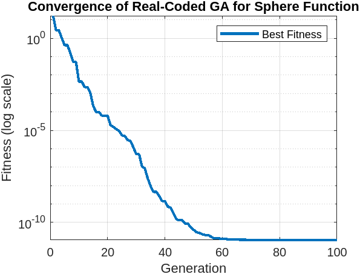
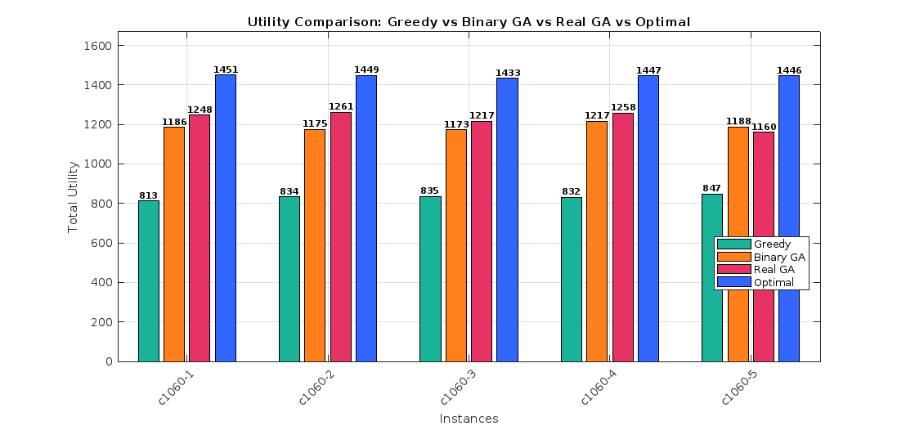

# 🚀 Real-Coded Genetic Algorithm (RCGA)

A MATLAB-based project demonstrating the application of **Real-Coded Genetic Algorithms (RCGA)** on:

- 📈 Sphere Function optimization (continuous benchmark function)
- 📦 Generalized Assignment Problem (GAP) with comparison to:
  - Binary-Coded Genetic Algorithm (BCGA)
  - Greedy approximation
  - Optimal solutions

---

## 🧠 1. Sphere Function Optimization

### 🎯 Objective:
Minimize the Sphere function:  
**f(x) = Σ xᵢ²**, where xᵢ ∈ [-10, 10]

### 🛠️ Features:
- Real-valued encoding
- Tournament selection
- BLX-α crossover
- Gaussian mutation

### 🔍 Convergence Graph:


- RCGA shows strong convergence properties on continuous domains.

---

## 📦 2. GAP: Real GA vs Binary GA vs Approximation vs Optimal

### 🧩 Objective:
Assign jobs to agents to maximize total utility without violating capacity.

### 📊 Visual Comparison:


| Instance | Greedy | Binary GA | Real GA | Optimal |
|----------|--------|-----------|---------|---------|
| c1060-1  | 813    | 1186      | 1248    | 1451    |
| c1060-2  | 834    | 1175      | 1261    | 1449    |
| c1060-3  | 835    | 1173      | 1217    | 1433    |
| c1060-4  | 832    | 1217      | 1258    | 1447    |
| c1060-5  | 847    | 1188      | 1160    | 1446    |

✅ Real GA achieves near-optimal performance and outperforms both BCGA and greedy approaches.

---

## 📂 File Structure

```
📁 project-root/
├── Real_coded_sphere.m                # RCGA for Sphere function
├── compareBGAvsRGAvsOPTIvsAPP.m      # GAP comparison script
├── sphere_RCGA_Graph.png             # Convergence plot
├── comp_RC_BC_APPX_OP.png            # GAP comparison plot
├── README.md                         # You're here!
```

---

## ▶️ How to Run

Open MATLAB and execute:

```matlab
% Run RCGA on Sphere Function
run('Real_coded_sphere.m')

% Run GAP Comparison
run('compareBGAvsRGAvsOPTIvsAPP.m')
```

Ensure data files (`*.csv`) are in the same folder.

---

## 📋 Requirements

- MATLAB R2021a or later
- Optimization Toolbox (for random functions and plots)

---


